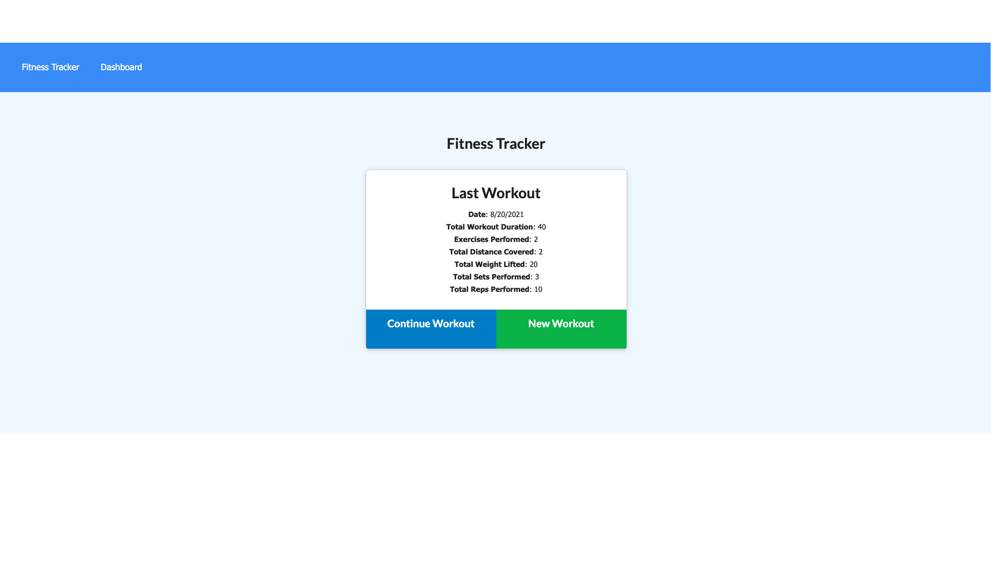

# Workout Tacker

## Description:
- Like a lot of difficult things, when it comes to exercising, being held accountable can have great influence on the results. This workout tracker will help with just that. Enter what kind of workout you're doing and all the details and you'll be able to track your stats.

## Table of Contents:
- [Installation](#installation)
- [Usage](#usage)
- [Visual Sample](#visual)
- [Contributors](#contributors)
- [Github](#github)
- [Email](#email)

## Installation:
- Anyone can use the application by going to the deployed link [here](https://floating-badlands-61761.herokuapp.com/)
- View the repository [here](https://github.com/ksapir/workout-tracker)

## Usage:
- Simply enter all the details and add the workout. Complete the workout to see the stats from that workout. 

## Visual Sample:

## Contributors:
- Karen Pion

## Contact:
- Github: ksapir
- Email: karenlpion@gmail.com
